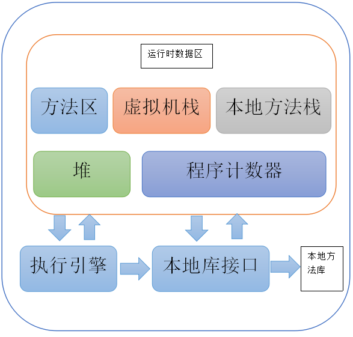

#深入理解java虚拟机

```
关于Dalvik虚拟机能不能执行class文件，我当时的回答是不能，但是它执行的是class转换的dex文件。当面试官继续问，为什么不能执行class文件时，我却只能回答Dalvik虚拟机内部的优化原因，却不能正确回答具体的原因。其实周志明的这本书就有回答：Dakvik并不是一个Java虚拟机，它没有遵循Java虚拟机规范，不能执行Java的class文件，使用的是寄存器架构而不是JVM中常见的栈架构，但是它与Java又有着千丝万缕的关系，它执行的dex文件可以通过class文件转化而来。
```
参考资料 《深入理解Java虚拟机》

---
###JVM 内存区域

```
我们在编写程序时，经常会遇到OOM（out of Memory）以及内存泄漏等问题。为了避免出现这些问题，我们首先必须对JVM的内存划分有个具体的认识。JVM将内存主要划分为：方法区、虚拟机栈、本地方法栈、堆、程序计数器。JVM运行时数据区如下： 
```

###程序计数器
```
程序计数器是线程私有的区域，很好理解嘛~，每个线程当然得有个计数器记录当前执行到那个指令。占用的内存空间小，可以把它看成是当前线程所执行的字节码的行号指示器。如果线程在执行Java方法，这个计数器记录的是正在执行的虚拟机字节码指令地址；如果执行的是Native方法，这个计数器的值为空（Undefined）。此内存区域是唯一一个在Java虚拟机规范中没有规定任何OutOfMemoryError情况的区域。
```
###Java 虚拟机栈

```
与程序计数器一样，Java虚拟机也是线程私有的。其生命周期与线程相同。如何理解虚拟机栈呢？本质上来讲，就是个栈。里面存放的元素叫栈帧，栈帧好像很复杂的样子，其实它很简单！它里面存放的是一个函数的上下文，具体存放的是执行的函数的一些数据。执行的函数需要的数据无非就是局部变量表（保存函数内部的变量）、操作数栈（执行引擎计算时需要），方法出口等等。

执行引擎每调用一个函数时，就为这个函数创建一个栈帧，并加入虚拟机栈。换个角度理解，每个函数从调用到执行结束，其实是对应一个栈帧的入栈和出栈。

注意这个区域可能出现的两种异常：一种是StackOverflowError，当前线程请求的栈深度大于虚拟机所允许的深度时，会抛出这个异常。制造这种异常很简单：将一个函数反复递归自己，最终会出现栈溢出错误（StackOverflowError）。另一种异常是OutOfMemoryError异常，当虚拟机栈可以动态扩展时（当前大部分虚拟机都可以），如果无法申请足够多的内存就会抛出OutOfMemoryError
```

###本地方法栈
```
本地方法栈与虚拟机所发挥的作用很相似，他们的区别在于虚拟机栈为执行Java代码方法服务，而本地方法栈是为Native方法服务。与虚拟机栈一样，本地方法栈也会抛出StackOverflowError和OutOfMemoryError异常。
```
###Java 堆

```
Java堆可以说是虚拟机中最大一块内存了。它是所有线程所共享的内存区域，几乎所有的实例对象都是在这块区域中存放。当然，睡着JIT编译器的发展，所有对象在堆上分配渐渐变得不那么“绝对”了。
Java堆是垃圾收集器管理的主要区域。由于现在的收集器基本上采用的都是分代收集算法，所有Java堆可以细分为：新生代和老年代。在细致分就是把新生代分为：Eden空间、From Survivor空间、To Survivor空间。当堆无法再扩展时，会抛出OutOfMemoryError异常。
```
### 方法区
```
方法区存放的是类信息、常量、静态变量等。方法区是各个线程共享区域，很容易理解，我们在写Java代码时，每个线程度可以访问同一个类的静态变量对象。由于使用反射机制的原因，虚拟机很难推测那个类信息不再使用，因此这块区域的回收很难。另外，对这块区域主要是针对常量池回收，值得注意的是JDK1.7已经把常量池转移到堆里面了。同样，当方法区无法满足内存分配需求时，会抛出OutOfMemoryError。 
制造方法区内存溢出，注意，必须在JDK1.6及之前版本才会导致方法区溢出，原因后面解释,执行之前，可以把虚拟机的参数-XXpermSize和-XX：MaxPermSize限制方法区大小。
```
> code

```
List<String> list =new ArrayList<String>();
int i =0;
while(true){
    list.add(String.valueOf(i).intern());
}

```

> 解释

```
运行后会抛出java.lang.OutOfMemoryError:PermGen space异常。 
解释一下，String的intern()函数作用是如果当前的字符串在常量池中不存在，则放入到常量池中。上面的代码不断将字符串添加到常量池，最终肯定会导致内存不足，抛出方法区的OOM。

下面解释一下，为什么必须将上面的代码在JDK1.6之前运行。我们前面提到，JDK1.7后，把常量池放入到堆空间中，这导致intern()函数的功能不同，具体怎么个不同法，且看看下面代码：

String str1 =new StringBuilder("hua").append("chao").toString();
System.out.println(str1.intern()==str1);

String str2=new StringBuilder("ja").append("va").toString();
System.out.println(str2.intern()==str2);

这段代码在JDK1.6和JDK1.7运行的结果不同。JDK1.6结果是：false,false ，JDK1.7结果是true, false。原因是：JDK1.6中，intern()方法会吧首次遇到的字符串实例复制到常量池中，返回的也是常量池中的字符串的引用，而StringBuilder创建的字符串实例是在堆上面，所以必然不是同一个引用，返回false。在JDK1.7中，intern不再复制实例，常量池中只保存首次出现的实例的引用，因此intern()返回的引用和由StringBuilder创建的字符串实例是同一个。为什么对str2比较返回的是false呢？这是因为，JVM中内部在加载类的时候，就已经有"java"这个字符串，不符合“首次出现”的原则，因此返回false。

```
###垃圾回收（GC）

```
JVM的垃圾回收机制中，判断一个对象是否死亡，并不是根据是否还有对象对其有引用，而是通过可达性分析。对象之间的引用可以抽象成树形结构，通过树根（GC Roots）作为起点，从这些树根往下搜索，搜索走过的链称为引用链，当一个对象到GC Roots没有任何引用链相连时，则证明这个对象是不可用的，该对象会被判定为可回收的对象。

```
> 那么那些对象可作为GC Roots呢？主要有以下几种：

* 1.虚拟机栈（栈帧中的本地变量表）中引用的对象。 
* 2.方法区中类静态属性引用的对象。 
* 3.方法区中常量引用的对象 
* 4.本地方法栈中JNI（即一般说的Native方法）引用的对象。


```
另外，Java还提供了软引用和弱引用，这两个引用是可以随时被虚拟机回收的对象，我们将一些比较占内存但是又可能后面用的对象，比如Bitmap对象，可以声明为软引用货弱引用。但是注意一点，每次使用这个对象时候，需要显示判断一下是否为null，以免出错。
```

> 三种常见的垃圾收集算法

* 标记-清除算法

```
通过可达性分析将可回收的对象进行标记，标记后再统一回收所有被标记的对象，标记过程其实就是可达性分析的过程。这种方法有2个不足点：效率问题，标记和清除两个过程的效率都不高；另一个是空间问题，标记清除之后会产生大量的不连续的内存碎片。
```
* 复制算法

```
为了解决效率问题，复制算法是将内存分为大小相同的两块，每次只使用其中一块。当这块内存用完了，就将还存活的对象复制到另一块内存上面。然后再把已经使用过的内存一次清理掉。这使得每次只对半个区域进行垃圾回收，内存分配时也不用考虑内存碎片情况。

但是，这代价实在是让人无法接受，需要牺牲一般的内存空间。研究发现，大部分对象都是“朝生夕死”，所以不需要安装1:1比例划分内存空间，而是将内存分为一块较大的Eden空间和两块较小的Survivor空间，每次使用Eden空间和一块Survivor空间，默认比例为Eden：Survivor=8:1.新生代区域就是这么划分，每次实例在Eden和一块Survivor中分配，回收时，将存活的对象复制到剩下的另一块Survivor。这样只有10%的内存会被浪费，但是带来的效率却很高。当剩下的Survivor内存不足时，可以去老年代内存进行分配担保。如何理解分配担保呢，其实就是，内存不足时，去老年代内存空间分配，然后等新生代内存缓过来了之后，把内存归还给老年代，保持新生代中的Eden：Survivor=8:1.另外，两个Survivor分别有自己的名称：From Survivor、To Survivor。二者身份经常调换，即有时这块内存与Eden一起参与分配，有时是另一块。因为他们之间经常相互复制。
```
* 标记-整理算法

```
标记整理算法很简单，就是先标记需要回收的对象，然后把所有存活的对象移动到内存的一端。这样的好处是避免了内存碎片。

```

### 类加载机制

```
类从被加载到虚拟机内存开始，到卸载出内存为止，整个生命周期包括：加载、验证、准备、解析、初始化、使用和卸载七个阶段。

其中加载、验证、准备、初始化、和卸载这5个阶段的顺序是确定的。而解析阶段不一定：它在某些情况下可以在初始化阶段之后再开始，这是为了支持Java的运行时绑定。

关于初始化：JVM规范明确规定，有且只有5中情况必须执行对类的初始化（加载、验证、准备自然再此之前要发生）： 
1.遇到new、getstatic、putstatic、invokestatic，如果类没有初始化，则必须初始化，这几条指令分别是指：new新对象、读取静态变量、设置静态变量，调用静态函数。 
2.使用java.lang.reflect包的方法对类进行反射调用时，如果类没初始化，则需要初始化 
3.当初始化一个类时，如果发现父类没有初始化，则需要先触发父类初始化。 
4.当虚拟机启动时，用户需要制定一个执行的主类（包含main函数的类），虚拟机会先初始化这个类。 
5.但是用JDK1.7启的动态语言支持时，如果一个MethodHandle实例最后解析的结果是REF_getStatic、REF_putStatic、Ref_invokeStatic的方法句柄时，并且这个方法句柄所对应的类没有进行初始化，则要先触发其初始化。

```

> 另外要注意的是：通过子类来引用父类的静态字段，不会导致子类初始化：

```
public class SuperClass{
    public static int value=123;
    static{
        System.out.printLn("SuperClass init!");
    }
}

public class SubClass extends SuperClass{
    static{
        System.out.println("SubClass init!");
    }


}

public class Test{
    public static void main(String[] args){
        System.out.println(SubClass.value);
    }
}

最后只会打印：SuperClass init! 
对应静态变量，只有直接定义这个字段的类才会被初始化，因此通过子类类引用父类中定义的静态变量只会触发父类初始化而不会触发子类初始化。

```

> 通过数组定义来引用类，不会触发此类的初始化：

```

public class Test{
    public static void main(String[] args){
        SuperClass[] sca=new SuperClass[10];
    }
}
```

> 常量会在编译阶段存入调用者的常量池，本质上并没有直接引用到定义常量的类，因此不会触发定义常量的类初始化，示例代码如下：

```
public class ConstClass{
    public static final String HELLO_WORLD="hello world";
    static {
        System.out.println("ConstClass init!");
    }

}

public class Test{
    public static void main(String[] args){

        System.out.print(ConstClass.HELLO_WORLD);
    }


}
上面代码不会出现ConstClass init!


```
###加载

```
加载过程主要做以下3件事 
1.通过一个类的全限定名称来获取此类的二进制流 
2.强这个字节流所代表的静态存储结构转化为方法区的运行时数据结构 
3.在内存中生成一个代表这个类的java.lang.Class对象,作为方法区这个类的各种数据访问入口。
```

###验证

这个阶段主要是为了确保Class文件字节流中包含信息符合当前虚拟机的要求，并且不会出现危害虚拟机自身的安全。

###准备

准备阶段是正式为类变量分配内存并设置类变量初始值的阶段，这些变量所使用的内存都在方法区中分配。首先，这个时候分配内存仅仅包括类变量（被static修饰的变量），而不包括实例变量。实例变量会在对象实例化时随着对象一起分配在java堆中。其次这里所说的初始值“通常情况下”是数据类型的零值，假设一个类变量定义为

public static int value=123;

那变量value在准备阶段后的初始值是0，而不是123，因为还没有执行任何Java方法，而把value赋值为123是在程序编译后，存放在类构造函数<clinit>()方法中。

###解析

解析阶段是把虚拟机中常量池的符号引用替换为直接引用的过程。

###初始化

类初始化时类加载的最后一步，前面类加载过程中，除了加载阶段用户可以通过自定义类加载器参与以外，其余动作都是虚拟机主导和控制。到了初始化阶段，才是真正执行类中定义Java程序代码。

准备阶段中，变量已经赋过一次系统要求的初始值，而在初始化阶段，根据程序员通过程序制定的主观计划初始化类变量。初始化过程其实是执行类构造器<clinit>()方法的过程。

<clinit>()方法是由编译器自动收集类中所有类变量的赋值动作和静态语句块中的语句合并产生的。收集的顺序是按照语句在源文件中出现的顺序。静态语句块中只能访问定义在静态语句块之前的变量，定义在它之后的变量可以赋值，但不能访问。如下所示：

public class Test{
    static{
        i=0;//給变量赋值，可以通过编译
        System.out.print(i);//这句编译器会提示：“非法向前引用”
    }
    static int i=1;

}
<clinit>()方法与类构造函数（或者说实例构造器<init>()）不同，他不需要显式地调用父类构造器，虚拟机会保证子类的<clinit>()方法执行之前，父类的<clinit>()已经执行完毕。

###类加载器

关于自定义类加载器，和双亲委派模型
