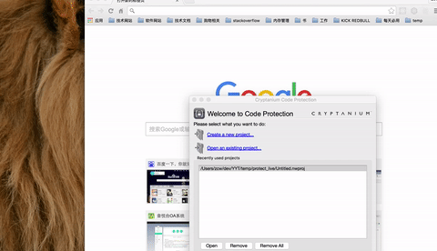
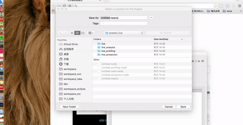
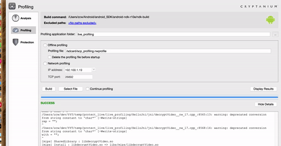
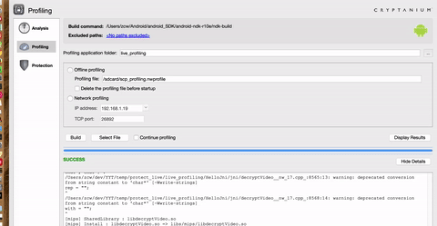
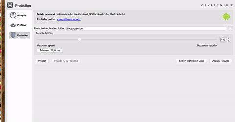
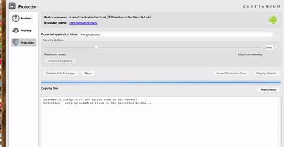
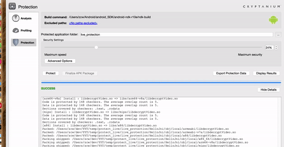
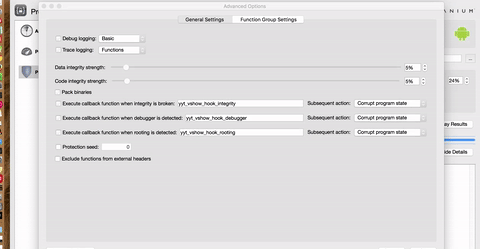

#Secure Knowledge

[1]:http://antukh.com/blog/2015/01/19/malware-techniques-cheat-sheet/


* 关于人物和自己用英文自我介绍
> 亚历山大 

```
亚历山大是一个充满激情的安全专家超过6年(正式),总是期待原始挑战和学习新东西的机会。他是一个防御莫斯科集团的创始人和现任领导人OWASP俄罗斯当地的章。他的特殊兴趣领域的应用密码学和所谓的“道德黑客”。
```

>  Alexander
 
[Alexander,亚历山大](http://antukh.com/blog/2015/01/19/malware-techniques-cheat-sheet/
) 

```
Alexander is a passionate Security Expert for over 6 years (formally), always looking towards original challenges and opportunities to learn something new. He is a founder of Defcon Moscow group and current leader of OWASP Russia Local Chapter. His special interest is in the field of applied cryptography and in what is called “ethical hacking”. 
```


> 关于Instruct 公司 __白盒代码保护__  __白盒签名保护__


1. 注册 [whiteCryption](http://www.whitecryption.com/)
2. 注册好了只好填写定制加密的选项，这个要靠经验，一般RSA AES DES 即可，收费的啊，真心贵
3. 然后就是到相应界面下载，他的GUI 工具。主要就是，SCP（ios） ，SKB （ios），JCP （JAVA）
4. 只要能看懂所有英文文档，那么解决起来相对容易。
5. SCP 一套 程序代码保护加固的白盒机制
6. SKB 一套 保护你的秘钥的机制。需要自己填写定制，自己写代码，进行加解密的操作规则
7. JCP java 代码保护方案，将你的java代码通过一定的机制转换成C/C++代码，打包后就是so，可以用Gradle 和 Ant 脚本配置。这样被逆向分析看到的只有so库和加密的库文件。逆向分析只能看到汇编代码
8. 此解决方案就是，将代码so加固，将java代码转换成so，将签名秘钥包装成skb的加密机制。即使当前代码被破解，重新执行SKB 打包，之前的SKB加密秘钥失效，保证了安全（本人认为加固的机制已经很不错，没做过黑客，不懂这里面的玄机）


> SCP 三部分操作(首先要安装SCP code protection)

* Anaylysis  分析，分析你的代码哪里应该加密，实际上就是程序在给你的项目代码分类。

* Profiling  切片压缩，就是真正处理你的代码，此时有离线处理和在线处理，差不多，在线处理要在同一个局域网。我用的离线处理，这个时候，首先需要你的Build成功，然后将Build后的so文件拷贝到你的jni项目目录替换，然后运行你的项目。此时会在手机里面生成一个文件，具体看gif图操作，选择这个文件，然后就会有分析的结果出现，证明你成功了

* Protection 真正的代码保护开始，build成功之后，这个时候的so包才是最终保护起来的包，然后大胆的把这个之前指定的JNI工程源代码生成的SO文件考到项目对应的目录，进行替换，至此SCP功能路程可以了，你的so被加固保密了
 
* [实例1](http://www.giphy.com/gifs/3o7qEc0PkVOR8KYfmM)

* [实例2](http://www.giphy.com/gifs/3o6EhYYnzi12vwkMUM)



















# 详细步骤 打包注意点

------

> 地址 

* 支付地址

* 正式环境地址

> manifest 产品ID 

* 修改产品id

* 修改渠道号【这个步骤集成在了gradle里面】 

> SCP 打包

*** Analysis 步骤 ***

--------

* Analysis 将C库源代码考出，放到本地的一个目录。

* 打开code Protection 的苹果安装好的程序

* 新建一个项目 默认ndk 目录 已经选择好了，正常情况source root ：HelloJni 。点击Analyze就行了。选择Use Default（ndk-build）下面的输出，分析后会出现Success字样
[目前来说不要调戏其他新特性，否则会有问题]

---------

*** Profiling 步骤 ***

------

* 点击Profilling ，正常folder ：HelloJni_profilling [同样提醒，暂时不要调戏特性]

* 选择Offine profling。（network profilling 也可以但要保证手机和电脑一个网段）

* 很重要的一步骤：#一切Profilling和Protect都是基于源代码#，点击Build ，#注意检查，源代码HeloJni里面的代码配置Android.mk Application.mk 和对应的三个.a 文件，对应的x86 armbi armbi-v7a armbi-v8a x86-64 mips ,一般armbi x86 armbi-v8a 这三个就够用了，armbi 对应 armbi-v7a 所以他这里面没有armbi-v7a #,其他的mips和x86-64 基本见不到，最好全面的覆盖。# armbi-v8a,x86-64 是64位芯片，所以c结构不同要区分对待#

* build 玩下面提示 对应的 armbi等结构和 success 证明成功了。这个时候到XXX_profilling 里面的libs生成目录，一般只会生成一个。将动态库，如：armbi/xxxx.so 拷贝到自己的真正再用的工程，在对应机型运行项目。 点击测试C代码调用的界面和模块，保证 采集到所有的so代码文件  profilling_data 的生成。#注意，armbi的机型跑出来的是armbi机型的data，armbi-v8a 等64 位的跑出来的不一样，要分别对待# ，跑完应用注意点#关掉应用，并杀死所有应用相关的进程，不然获取不到profilling Data#，adb 查看 scp profilling data是否生成。命令 “adb shell”,"ls /sdcard/scp*" 如果检查存在退出adb shell “adb pull scpXXXX.profill dev(本地位置)” 备用

*** Protection  ***

---------

* 注意#一切都是基于源代码，所以注意修改Application.mk 文件的芯片类型#，第二个注意 #armbi 对应的是armbi的profilling data，armbi-v8a 对应的是另一个区别对待 # ，在上个步骤的末尾， 点击Profilling -> select File 选择生成的Profilling Data。

* 点击Protection 这个时候等待 Protection的 保护so生成把。祝君好运。出现Success 字样证明成功。 然后将XXXXX_protection 文件夹下的lib/xxxso 就是scp打包好的so，拷贝到自己的工程 # 注意切换不同机型和profiledata，要修改/源代码下面/ Application.mk 和对应的 不同cpu的.a 库进行替换操作# 

----------

> 加固

* 利用360或者百度的加固工具加固，加固后的文件是脱壳去掉签名的apk，将加固的apk下载回来

* 加固后，记得签名（可以用自带的sdk自己写脚本签名，也可以用平台提供的工具，但不保证安全）


> 版本号修改

------

> 有意思的特殊字符
> 
> <font face="黑体" color=#0099ff>0xAA</font>
> 
> <font face="黑体" color=#0099ff>0x55</font>
 